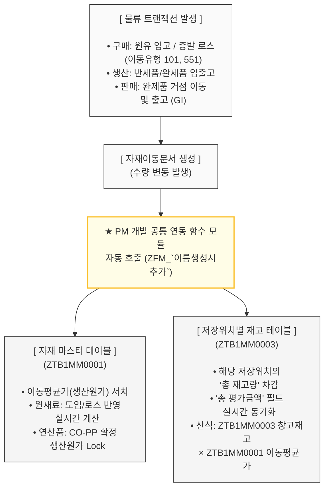

# SCM-FCM 물류 트랜잭션 기반 전사 원가 동기화 인터페이스 명세

**최종 수정일**: 2026-05-11  
**상태**: 확정 (Approved)  
**관련 컴포넌트**: MM (구매/재고), PP (생산), SD (판매), FI/CO (재무/원가)

---

## 1. 개요 (Overview)
정유 공정의 물류 흐름(`자재이동문서`)에 따라 변동되는 재고 자산의 수량과 가치를 재무/원가 장부와 실시간으로 일치시키기 위한 전사 데이터 연동 아키텍처.

기존 [system-flow-v4.md](system-flow-v4.md) 에서 정의된 전체 마스터 플로우를 기반으로 하되, 물류 트랜잭션 발생 시 자재 마스터(ZTB1MM0001 테이블)의 **고정 생산원가(Cost)와** 저장위치별 재고(ZTB1MM0003 테이블)의 **총 재고량 및 총 평가금액** 필드가 상호 작용하는 세부 인터페이스 로직을 명시함.

---

## 2. 중앙 통제형 데이터 흐름도 (Data Architecture)

ZTB1MM0001 및 ZTB1MM0003 테이블을 직접 수정하지 않고, 반드시 Member 1(PM)이 개발한 공통 함수 모듈을 호출하여 데이터 정합성을 방어함.

---

## 3. 트랜잭션 단계별 자재 이동 및 원가 연동 상세 로직

### ① 구매 (Procurement) 단계
* **원유 도입 입고**
  - **자재이동문서**: 원유 선적 및 플랜트 입고 전표 생성 (예: WTI원유, 200 BBL, $500)
  - **ZTB1MM0003 테이블**: 해당 저장위치의 총재고량 및 총평가금액 실시간 업데이트
  - **ZTB1MM0001 테이블**: 부대비용(운송비 등) 누적 계산 산식에 따른 최신 이동평균가(원가) 업데이트
* **플랜트 이송 및 증발 손실(Loss) 처리**
  - **자재이동문서**: 이송 중 자연 증발에 따른 손실 전표 생성 (이동유형 551)
  - **ZTB1MM0003 테이블**: 손실 수량만큼 총재고량 차감, 자산 가치 유지에 따른 총평가금액 재계산
  - **ZTB1MM0001 테이블**: 잔여 수량 대비 가치 보존 법칙에 따라 자재 마스터 이동평균가(원가) 상향 업데이트

### ② 생산 (Manufacturing) 단계
* **반제품 생산 출고 (정제 투입)**
  - **자재이동문서**: 원재료 출고 전표 생성 (예: WTI원유, 200 BBL, $500)
  - **ZTB1MM0003 테이블**: 원재료 저장위치의 총재고량 및 총평가금액 차감
  - **ZTB1MM0001 테이블**: 구매단이 확정해 둔 원재료 이동평균가를 래퍼런스로 참조하여 출고 원가 유지
* **반제품 생산 입고 (1차 정제 완료)**
  - **자재이동문서**: 반제품 입고 전표 생성 (예: 반제 LPG, 200 BBL, $500)
  - **ZTB1MM0003 테이블**: 생산 창고의 반제품 총재고량 및 총평가금액 업데이트
  - **ZTB1MM0001 테이블**: CO-PP가 합산 추정한 1차 정제 생산원가 반영 및 이동평균가 업데이트 (예: 단가 $1,100 선 반영)
* **완제품 생산 출고 (최종 후공정 투입)**
  - **자재이동문서**: 반제품 출고 전표 생성 (예: 반제 LPG, 200 BBL, $500)
  - **ZTB1MM0003 테이블**: 반제품 창고의 총재고량 및 총평가금액 차감
  - **ZTB1MM0001 테이블**: 기 수립된 반제품 이동평균가를 레퍼런스로 원가 유지
* **완제품 최종 생산 입고 (최종 제품화)**
  - **자재이동문서**: 완제품 입고 전표 생성 (예: 완제 LPG, 200 BBL, $500)
  - **ZTB1MM0003 테이블**: 완제품 창고의 최종 제품 총재고량 및 총평가금액 업데이트
  - **ZTB1MM0001 테이블**: 최종 후공정 가공비가 누적 합산된 고정 생산원가 반영 및 이동평균가 업데이트 (예: 단가 $1,200 선 반영)

---

## 4. 예외 케이스 처리 및 데이터 방어 규칙 (Exception Handling)

* **모듈별 테이블 업데이트 범위 상이성에 따른 공통 펑션 제어 (SD 출고 분기)**
  - **현상**: 구매(원유 도입/로스) 및 생산(반제/완제 입고) 트랜잭션은 자재의 가치 변동을 동반하므로 `ZTB1MM0003`(저장위치별 재고)과 `ZTB1MM0001`(자재 마스터) 테이블을 모두 실시간 업데이트해야 함. 반면, 판매(SD)의 완제품 출고 시에는 거점 창고의 재고 가치만 차감될 뿐, 제품 고유의 '고정 생산원가'는 변하지 않으므로 `ZTB1MM0003` 테이블만 업데이트하고 `ZTB1MM0001` 테이블은 업데이트에서 제외해야 하는 로직의 차이가 발생함.
  - **방어 로직 (공통화)**: Member 1(PM)은 각 프로그램이 모듈별로 서로 다른 펑션을 호출하는 파편화를 방지하기 위해, 하나의 공통 함수 모듈 내부에서 입력 인수를 판별하는 예외 분기 처리 로직을 구현함.
  - 이를 통해 판매 출고 트랜잭션 유입 시, 함수가 자동으로 `ZTB1MM0001` 테이블 수정을 스킵(Skip)하도록 제어하여 완제품의 고정 생산원가 오염을 원천 차단하고, 전사 모듈이 단 하나의 공통 펑션 인터페이스만 공유할 수 있도록 아키텍처 안정성을 확보함.
---

## 5. 비즈니스 정합성 검증 결과 (Value Flow)
본 인터페이스 아키텍처를 통해 영업/판매(SD) 모듈이 글로벌 시황(MOPS)에 따라 판매 가격(Price)을 다이내믹하게 변동시켜 매출을 일으키더라도, 시스템 내부의 출고 원가는 ZTB1MM0001 테이블에 고정된 **'생산원가(Cost)'**를 기준으로 안정적으로 차감됨.

생산단 역시 CO-PP가 도출한 1차 계산 공정비용을 자재이동 시 발생하는 가치 금액으로 다이렉트 매핑하여, 특정 이동유형을 통해 공정비용 G/L 계정과 연동되도록 완벽히 설계함.
결과적으로 복잡한 전표 전사 리스크 없이 공통 함수의 [ZTB1MM0003 가용재고 수량 차감 × ZTB1MM0001 고정 생산원가] 공식에 의해 전사 재고 정합성과 물류 거점별 마진 분석 체계를 심플하고 명확하게 완성함.
