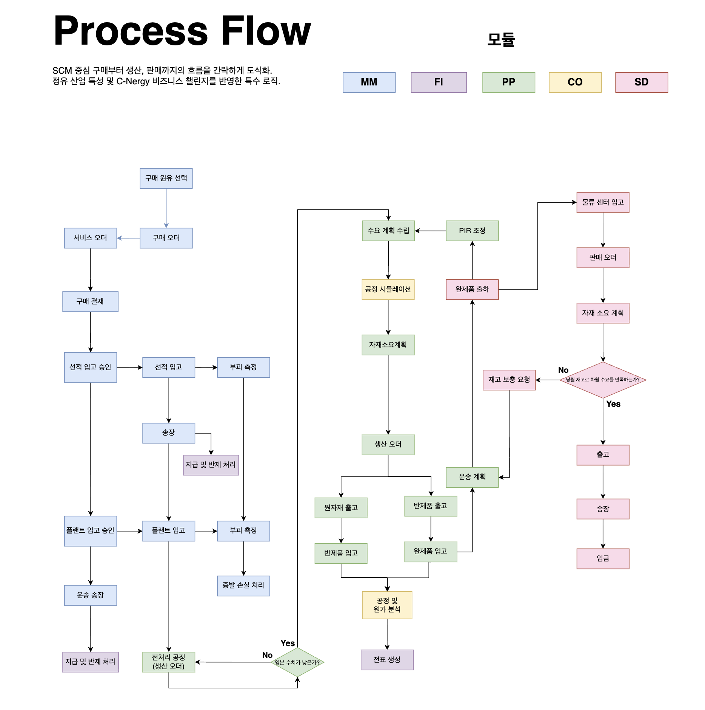

# SAP Integrated Module Flow v5.0 (Final)

Date: 2026-07-15
Status: Finalized (To-Be Process)

## 1. 개요
최종 시연 프로세스 및 CBO 개발 범위를 확정함에 따라, MM-PP-SD-FI-CO 전사 모듈 간 트랜잭션과 의사결정 흐름을 최후 버전(v5.0)으로 완성함. v4.0 대비 품질 관리 조건문(염분 수치) 추가, CO 공정 원가 분석 시점 정교화, Demand-driven PIR 역산 체계가 프로세스 플로우 상에 완전히 통합됨.

---

## 2. 주요 변경 및 고도화 사항 (v4.0 vs v5.0)

### ① 원유 품질 기반 전처리 공정 조건문 추가 (MM-PP)
* **염분 수치 분기 로직 적용**: 플랜트 입고 후 원유의 염분 수치(Salt Content) 판정 분기 추가.
* **조건별 공정 흐름**: 염분 수치가 높은 경우 '전처리 공정(생산 오더)'을 반드시 거친 후 본 공정으로 투입되며, 수치가 기준 이하(No)인 경우 즉시 수요 계획 및 공정 시뮬레이션 단계로 연결됨.

### ② CO 원가 분석 및 전표 연동 시점 정교화 (PP-CO-FI)
* **공정 및 원가 분석 이원화**: 원자재 출고/반제품 입고, 반제품 출고/완제품 입고 트랜잭션 발생 직후 '공정 및 원가 분석(CO)' 단계로 집계되도록 흐름 확정.
* **자동 전표 발행**: 원가 분석 결과를 바탕으로 FI 모듈에 즉시 전표가 생성 및 생성되도록 인터페이스 최적화.

### ③ 수요 역산형(Demand-Driven) 물류센터-생산 연계 강화 (SD-PP)
* **재고 충족 여부 분기 조건**: 물류센터 자재 소요 계획 시 '당월 재고로 차월 수요를 만족하는가?'에 대한 시스템 판단 조건문 명시.
* **PIR 자동 조정 흐름**: 재고 부족 시 생성된 '재고 보충 요청' 및 '운송 계획'이 완제품 출하 후 본사 PP의 'PIR 조정'으로 직결되어 최상위 수요 계획에 즉시 반영되는 Closed-loop 완성.

---

## 3. 모듈별 최종 트랜잭션 연동 현황 (Integration Point)

| 구분 | 프로세스 접점 | 주요 연동 데이터 (Key Data) |
| :--- | :--- | :--- |
| **MM-PP** | 원유 입고 및 전처리 판정 | 부피 측정 데이터, 증발 손실량, 염분 수치(Salt Content) |
| **PP-CO-FI** | 생산 실적 및 원가 배부 | 원자재/반제품/완제품 출입고 수량, 공정비, 원가 분석 전표 |
| **SD-PP** | 수요 역산 및 PIR 반영 | 물류센터 가용재고, 재고 보충 요청(DR), PIR 조정 데이터 |
| **MM-FI** | 대금 정산 및 손실 반영 | 선적/플랜트 입고 송장, 지급 및 반제, 증발 손실 전표 |
