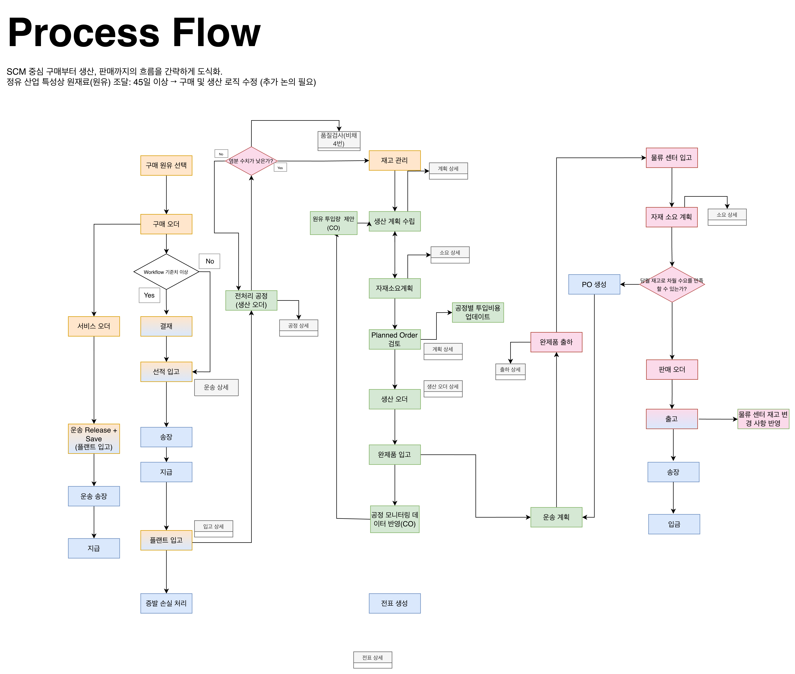

# SAP Integrated Module Flow v3.0

Date: 2026-03-30

## 개요
1차 컨설턴트 리뷰 피드백을 반영하여 정유 산업 특유의 긴 리드타임과 물류 거점 중심의 유통 구조를 시스템 흐름에 명확히 정의함. 기존 v2.0 대비 대금 지급 시점, 재고 인식 시점, 그리고 모듈 간 의사결정 주체를 실무에 가깝게 재설계함.

## 주요 흐름 변경점

**1. 구매 및 물류 프로세스 고도화 (MM-FI 연계)**
- **대금 지급 흐름 재정의**: 기존 '입고 후 지급' 방식에서 '선적 입고 - 송장 - 지급 - 플랜트 입고' 순으로 프로세스를 변경함.
- **선적 시점 장부 재고 인식**: 약 45일의 리드타임을 고려하여 선적 시점에 장부 재고를 기록하고, 해당 수량만큼 금액을 확정하여 공급업체에 대금을 지급함.
- **증발 손실(Loss) 처리**: 실제 플랜트 입고 시점에 환산 부피 기준의 차이를 계산하여 증발 손실분만큼 로스(Loss) 전표를 생성함.

**2. 운송 및 서비스 PO 시점 명확화 (LE 연계)**
- **정산 주체 분리**: 자재 공급업체에게 송장을 지급하는 프로세스와 운송업체에게 송장을 지급하는 프로세스를 명확히 분리함.
- **서비스 오더 연동**: 운송 및 부대비용 처리를 위한 서비스 오더(Service PO) 적용 시점을 명확히 함.

**3. 생산 의사결정 프로세스 상세화 (PP 중심)**
- **PP 단독 의사결정 체계**: 기존 CO와 PP가 혼재되어 있던 원유 투입량 제안, 공정별 투입비용 업데이트, 공정 모니터링 데이터 반영 등의 기능을 PP 모듈의 의사결정 영역으로 확정함.
- **공정 가시성 확보**: 생산 현장의 모니터링 데이터가 생산 계획 및 자재소요계획(MRP)에 실시간으로 환류되는 구조를 상세화함.

**4. 거점 기반 판매 및 재고 보충 로직 (SD-MM-PP 연계)**
- **물류센터(Depot) 중심 운영**: 물류센터의 실시간 재고 변경 사항을 상시 업데이트하며, 당월 재고로 차월 수요 충족 여부를 판단함.
- **수요 기반 출하**: 수요 부족 판단 시 구매오더(PO)를 생성하고, 완제품 창고에서 물류센터(거점)로 이동하는 운송 계획을 수립하여 물량을 출하함.
- **입고 연동 MRP**: 물류센터에 완제품이 입고되는 시점에 다시 자재소요계획(MRP)이 구동되도록 프로세스를 연결함.

**5. 결재 워크플로우(Workflow) 최적화**
- **적용 범위 조정**: 판매와 구매 오더 모두에 존재하던 결재 프로세스를 실무 효율성을 고려하여 구매 오더(PO) 생성 시에만 적용되도록 통합 및 간소화함.

