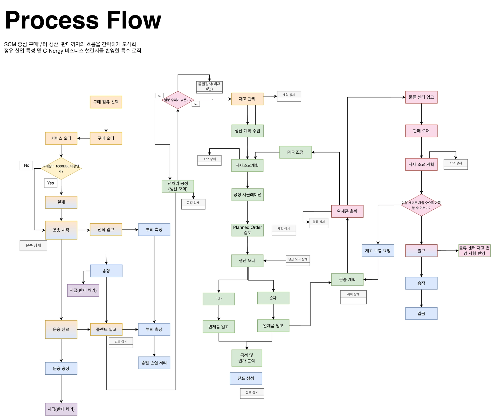

# SAP Integrated Module Flow v4.0

**Date:** 2026-04-03
**Status:** Finalized (Reflecting 4/2 Technical Review)

## 1. 개요
4월 2일 강사님 면담 및 팀별 기술 검토를 통해, 정유 산업의 물리적 특성(부피 변화, 공정 단계)이 시스템 트랜잭션과 일치하도록 프로세스를 고도화함. 특히 모듈 간 데이터 단절 구간을 해소하고, 실질적인 프로그램 구현 리스트(ABAP/Fiori)와 연동될 수 있도록 시점별 로직을 확정함.

---

## 2. 주요 변경 및 고도화 사항 (v3.0 vs v4.0)

### ① 구매·물류 이원화 정산 및 부피 보정 (MM-FI)
* **오더 분리 및 동시 실행**: 원유 공급처를 위한 '구매 오더'와 운송업체를 위한 '서비스 오더'의 발행 시점을 동일하게 가져가되, 이후 입고·송장·지급 프로세스는 각 업체의 업무 리드타임에 맞춰 독립적으로 흐르도록 명확히 분리함.
* **단계별 부피 측정 로직**: 
    - **선적 시점**: 1차 부피 측정 후 '환산 부피'로 장부 재고 반영 및 대금 지급 근거 마련.
    - **플랜트 입고 시점**: 2차 실측 부피 측정 후, 선적 시점 데이터와의 차이를 계산하여 **증발 손실(Internal Loss) 전표**를 자동 생성하는 로직 확정.

### ② 생산 실적 입고의 단계화 (PP-CO)
* **반제품/완제품 입고 분리**: 생산 오더 이후 실적 기록 시, 1차(반제품) 입고와 2차(완제품) 입고 과정을 병렬/순차적으로 가시화함.
* **실측 기반 원가 분석**: 생산 계획은 '예측'으로 관리하되, 자재 입고 시 '실측' 데이터를 반영하여 **공정 및 원가 분석(Variance Analysis)의** 정확도를 높이는 흐름으로 재설계함.

### ③ 물류센터(Depot) 중심의 수요 환류 로직 (SD-MM-PP)
* **Closed-loop 구조 완성**: 물류센터의 '자재 소요 계획' 결과가 단순히 구매로 끝나는 것이 아니라, 본사(공장)의 생산 계획 및 출하 승인으로 직접 환류되는 구조를 명시함.
* **시점 기반 의사결정**: 물류센터 재고 변경 사항이 본사 딜리버리(DO)를 트리거하고, 이것이 다시 생산 현장의 MRP 구동으로 이어지는 순환 화살표를 통해 모듈 간 정합성을 확보함.

### ④ 결재 워크플로우(Workflow) 최적화
* **기준치 기반 통제**: 구매(MM)와 판매(SD) 프로세스 전반에 걸쳐 'Workflow 기준치 이상' 여부를 판단하는 Decison Diamond를 추가하여, 고액 거래나 비표준 거래에 대한 시스템적 통제 장치를 강화함.

---

## 3. 모듈별 트랜잭션 접점 (Integration Point)

| 구분 | 프로세스 접점 | 주요 연동 데이터 (Key Data) |
| :--- | :--- | :--- |
| **MM-FI** | 송장 검증 및 지급 | 구매가, 환율, 세금 코드(V0/V1), 운송비용 |
| **PP-MM** | 자재 투입 및 입고 | 원유 투입량(실측), 완제품 생산량, 저장위치(SLoc) |
| **SD-MM** | 물류센터 보충 | 재고 보충 요청(DR), 배송 오더(DO), 이송 재고 |
| **PP-SD** | 생산 계획 반영 | 물류센터 수요 예측(FC), 가용 재고(ATP) |

---

## 4. 향후 계획
본 v4.0 Flow를 바탕으로 각 프로그램의 **Functional Specification(상세 설계서)** 작성을 완료하고, 실제 ABAP 개발 및 Fiori UI 설계 시 데이터 필드 매핑의 기준으로 활용함.
