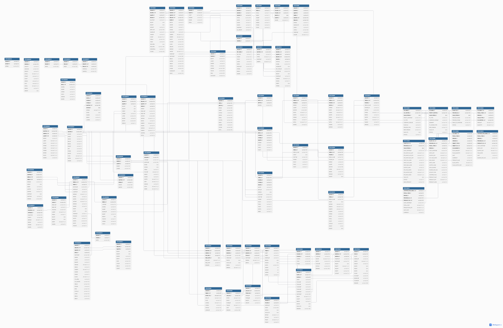

# 01_erd.md

## 1. 통합 데이터 모델 
v1.0 - Date: 2026-04-02

정유 산업의 비즈니스 복잡성(운송 리드타임, 수율 변동, 거점 재고)을 수용하기 위해 설계된 초기 통합 ERD입니다. MM, PP, SD, FI/CO 각 모듈의 핵심 엔티티 간 관계를 정의하였습니다.

*파일명: 260402.png / 4월 2일 1차 확정본*

---

## 2. 비즈니스 로직별 데이터 설계 상세

### 2.1 구매 및 수입 물류 (MM)
* **이원화 오더 관리**: 원유 구매를 위한 Vendor와 운송 서비스를 위한 Carrier를 구분하여 관리하며, 동일한 거래 시점에서 두 가지 PO가 생성될 수 있도록 참조 관계를 설정하였습니다.
* **부피 환산 데이터**: 온도 변화에 따른 부피 팽창/수축을 기록하기 위해 재고 수불 테이블에 표준 온도(15℃) 환산 필드를 추가하였습니다.

### 2.2 생산 및 수율 관리 (PP)
* **변동 수율 추적**: 정유 공정의 특성인 연산품(Co-product) 구조를 반영하여, 하나의 생산 오더에서 여러 개의 완제품/반제품 입고 문서가 생성되는 일대다(1:N) 관계를 구축하였습니다.
* **실측 데이터 반영**: 생산 계획(Planned)과 실제 투입/산출(Actual) 데이터를 이원화하여 관리 회계적 원가 차이(Variance)를 분석할 수 있도록 설계하였습니다.

### 2.3 거점 물류 및 판매 (SD)
* **재고 보충 요청(DR)**: 물류센터(Depot)와 본사 플랜트 간의 재고 이동을 관리하기 위해 요청-승인-출고-입고로 이어지는 프로세스 체인을 데이터 모델로 구현하였습니다.
* **실시간 ATP**: 물류 센터 입장에서 볼 수 있는 가용 재고(ATPQ)가 판매 오더 생성 시점에 실시간으로 체크될 수 있도록 MARD 테이블 등과의 조인 구조를 최적화하였습니다.

---

## 3. 설계 특징 및 제약 사항
* **실시간 FI 연동**: 모든 물류 트랜잭션(이동 유형)은 재무 전표(BKPF/BSEG)와 연계되어, 증발 손실 및 운송비 정산 시 자동으로 회계 전표가 파생됩니다.
* **환율 마스터**: 대규모 수입 거래의 특성상 결산용 확정 환율을 관리하기 위한 별도의 유지보수 뷰(Maintenance View) 테이블을 포함하고 있습니다.

---

## 4. 변경 이력
* **2026-04-02**: 초기 통합 데이터 모델링 완료 (v1.0).
* **2026-04-03**: 강사님 피드백 및 모듈 통합 회의 결과를 반영하여 구매/운송 오더 분리 로직 상세화.
