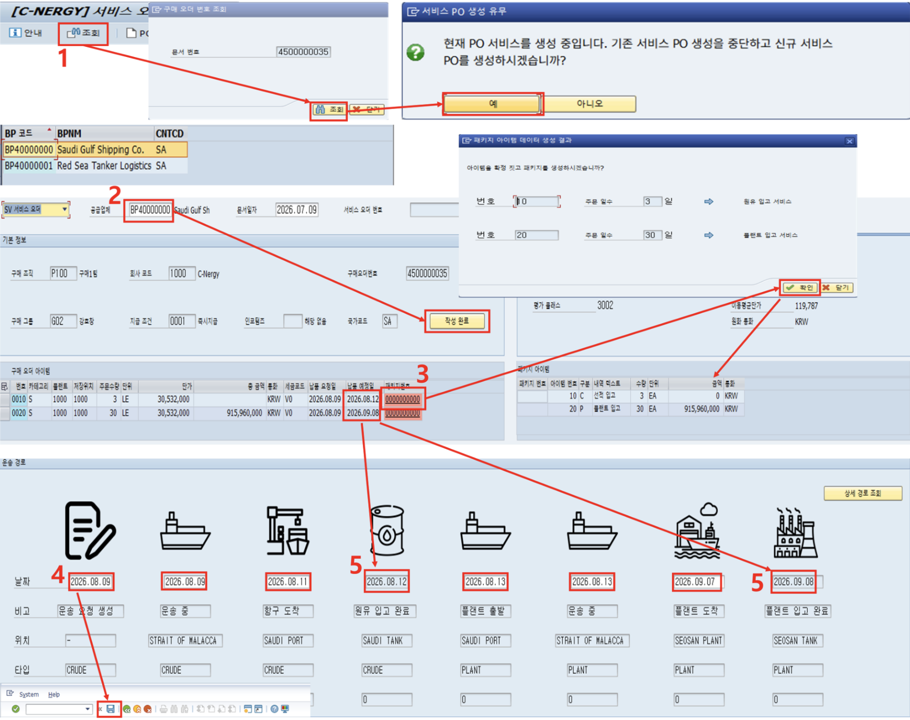

# [MM] 서비스 오더 생성
 
- **개요**: 구매오더 조회 후 동일 운송업체 기준 서비스오더(SES 대상) 생성, 운송경로·서비스패키지 데이터 핫스팟 자동 생성.
- **비즈니스 로직**:
  1. 구매오더 번호 입력 후 조회
  2. 기존 서비스 PO 생성 중단 확인 팝업 → 신규 서비스 PO 생성 확정
  3. 공급업체와 동일 운송업체 선택 후 작성완료
  4. 서비스 패키지·운송 경로 데이터 핫스팟 자동 생성(원유 입고~플랜트 입고 6단계)
  5. 단계별 날짜 입력 후 서비스 오더 최종 저장
  6. 원유/플랜트 입고 완료 시점 납품 예정일 자동 입력
- **관련 테이블**: [`ZTB1MM0006`](../../04_design/table_specifications/01_MM_table_spec.md#index06)(구매오더 헤더), [`ZTB1MM0007`](../../04_design/table_specifications/01_MM_table_spec.md#index07)(구매오더 항목), [`ZTB1MM0009`](../../04_design/table_specifications/01_MM_table_spec.md#index09)(SES 헤더), [`ZTB1MM0010`](../../04_design/table_specifications/01_MM_table_spec.md#index10)(SES 항목), [`ZTB1MM0021`](../../04_design/table_specifications/01_MM_table_spec.md#index21)(운송현황), [`ZTB1MM0022`](../../04_design/table_specifications/01_MM_table_spec.md#index22)(국가별 운송경로 마스터)
- **기술 스택**: ABAP RAP(SES 헤더/항목 BO), Fiori Elements Object Page, OData Navigation(핫스팟)
- **연동 흐름**: SES 확정 → 자재문서 생성([`ZTB1MM0011`](../../04_design/table_specifications/01_MM_table_spec.md#index11), [`ZTB1MM0012`](../../04_design/table_specifications/01_MM_table_spec.md#index12)) → FI 전표(ZTBF10001, ZTBF10002) 자동 인터페이스(매입/AP)

