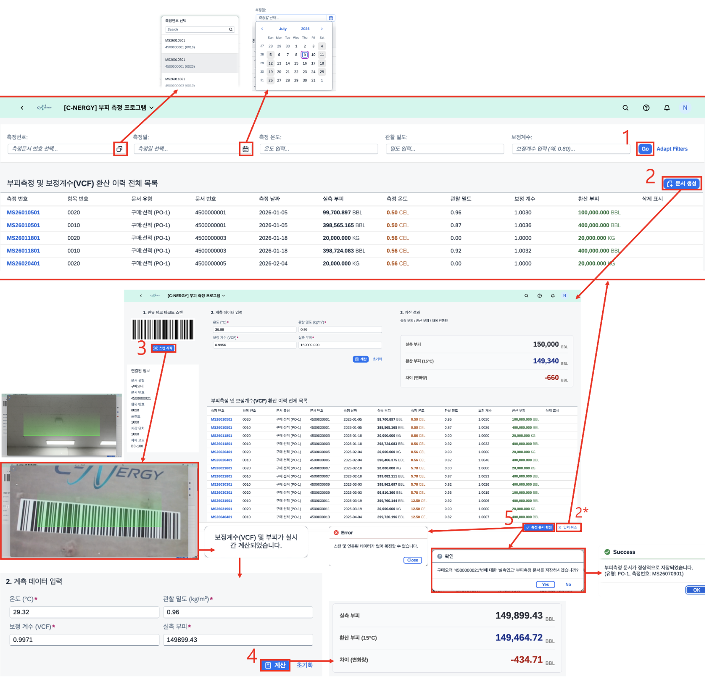

# [MM] 부피 측정

- **개요**: 원유·제품 실측 부피를 온도/밀도 기준 15℃ 표준 부피(VCF)로 환산하고, 바코드 스캔으로 구매 정보 자동 연동.

- **비즈니스 로직**:
  1. 조건 입력(측정문서/일자/원인/VCF) 후 조회 → 환산 이력 확인
  2. 문서 생성 클릭 → 입력 화면 이동
  3. 바코드 스캔 → 자재 구매 정보 및 VCF 자동 연동
  4. 데이터 입력(온도, 관찰 밀도, 실측 부피) 후 '계산' → 15℃ 표준 부피 환산
  5. '측정문서 확인' 클릭 → 오류 검증 후 문서번호·유형 자동 할당 및 저장

- **관련 테이블**: [`ZTB1MM0018`](../../04_design/table_specifications/01_MM_table_spec.md#index18)(부피측정 마스터), [`ZTB1MM0020`](../../04_design/table_specifications/01_MM_table_spec.md#index20)(부피 측정 이력)

- **기술 스택**: ABAP RAP, Fiori Elements(Custom Page + Barcode Scanner), CDS View(VCF 산출)

- **연동 흐름**: 환산 확정 → 재고 수량/평가금액 갱신([`ZTB1MM0003`](../../04_design/table_specifications/01_MM_table_spec.md#index03)) → 재고변동 이력 기록([`ZTB1MM0023`](../../04_design/table_specifications/01_MM_table_spec.md#index23), [`ZTB1MM0024`](../../04_design/table_specifications/01_MM_table_spec.md#index24))

