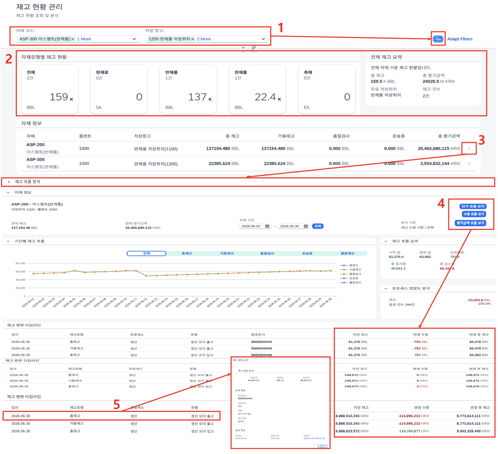

# [MM] 재고 현황 관리

- **개요**: 자재유형별·저장위치별 재고 현황 및 평가금액 조회, 기간별 재고 흐름 추적.

- **비즈니스 로직**:
  1. 자재/저장창고 조건 입력 후 조회
  2. KPI Tile로 자재유형별(원재료/반제품/완제품/촉매) 재고 현황 확인
  3. 자재 정보 아이템 클릭 → 기간별 재고 흐름 페이지 이동
  4. 수량/평가금액/단가 버튼 클릭 시 타임라인 테이블 전환
  5. 타임라인 데이터 클릭 → 자재 변경 상세 화면 확인

- **관련 테이블**: [`ZTB1MM0003`](../../04_design/table_specifications/01_MM_table_spec.md#index03)(저장위치별 재고), [`ZTB1MM0023`](../../04_design/table_specifications/01_MM_table_spec.md#index23)(재고 변동 관리 헤더), [`ZTB1MM0024`](../../04_design/table_specifications/01_MM_table_spec.md#index24)(재고 변동 관리 아이템), [`ZTB1MM0011`](../../04_design/table_specifications/01_MM_table_spec.md#index11)(자재 이동 문서 헤더), [`ZTB1MM0012`](../../04_design/table_specifications/01_MM_table_spec.md#index12)(자재 이동 문서 항목)

- **기술 스택**: Fiori Elements Overview Page(KPI Tile), CDS Analytical View, Fiori Elements List Report(타임라인)

- **연동 흐름**: MM 수불 발생([`ZTB1MM0011`](../../04_design/table_specifications/01_MM_table_spec.md#index11), [`ZTB1MM0012`](../../04_design/table_specifications/01_MM_table_spec.md#index12)) → 실시간 재고 반영 → SD 자재 운송 보충 계획 프로그램 가용재고 데이터 소스 제공

