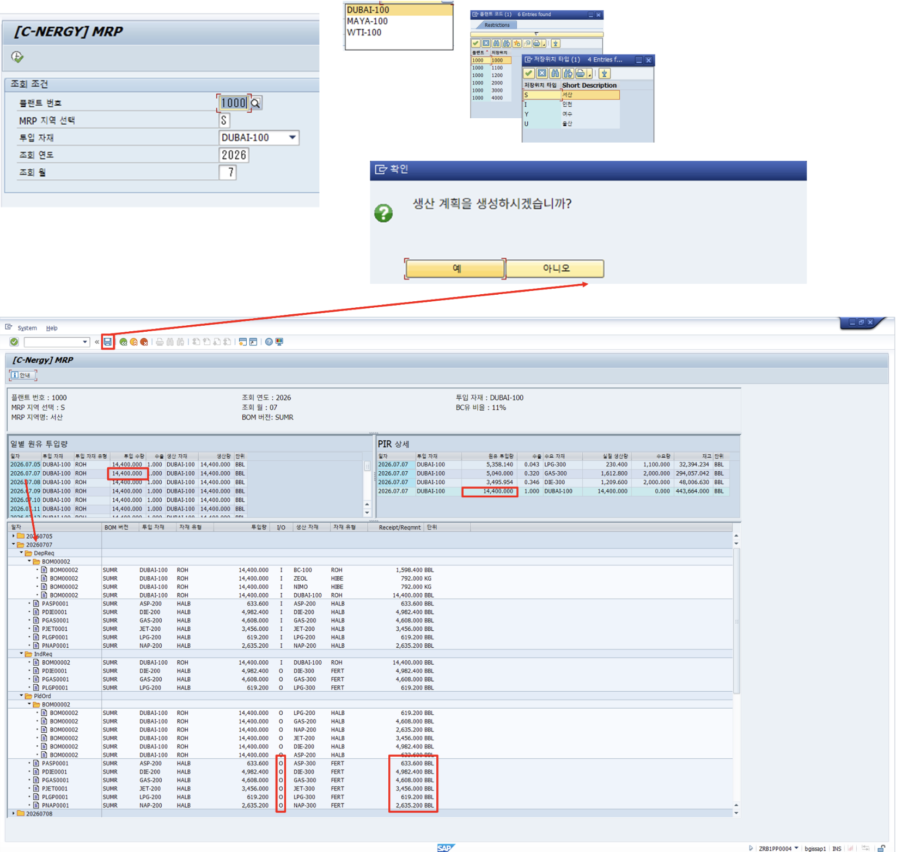

# [PP] MRP

- **개요**: PIR·재고·BOM·설비 처리량 종합, 원유 투입 계획 자동 산출. 완제품 수요 부재 시에도 설비 최소 가동률 기준 투입량 결정.

- **비즈니스 로직**:
  1. 플랜트/MRP 지역/투입 자재/조회 연도·월 조건 입력 후 실행
  2. 생산 계획 생성 확인 팝업 → 확정
  3. 자재 재고와 완제품 수요 비교 → 실질 생산량 계산
  4. 계절별 BOM 기반 완제품 → 원유 투입량 역산 및 최적값 자동 선택
  5. 일일 설비 처리량으로 투입량 상/하한 보정
  6. 순방향 전개로 연산품 생산량 계산 → 저장 → 생산 계획 생성/수정

- **관련 테이블**: [`ZTB1PP0001`](../../04_design/table_specifications/02_PP_table_spec.md#index01)(PIR), [`ZTB1PP0002`](../../04_design/table_specifications/02_PP_table_spec.md#index02)(BOM 헤더), [`ZTB1PP0003`](../../04_design/table_specifications/02_PP_table_spec.md#index03)(BOM 아이템), [`ZTB1PP0011`](../../04_design/table_specifications/02_PP_table_spec.md#index11)(MRP 헤더), [`ZTB1PP0012`](../../04_design/table_specifications/02_PP_table_spec.md#index12)(MRP 아이템), [`ZTB1PP0013`](../../04_design/table_specifications/02_PP_table_spec.md#index13)(생산계획·오더 헤더), [`ZTB1PP0014`](../../04_design/table_specifications/02_PP_table_spec.md#index14)(생산계획·오더 아이템)

- **기술 스택**: ABAP RAP(MRP 실행 BO), 백엔드 배치 로직(순방향 전개 알고리즘), CDS View

- **연동 흐름**: MRP 확정 → 생산계획 자동 생성([`ZTB1PP0013`](../../04_design/table_specifications/02_PP_table_spec.md#index13) PLNTY=PLN) → 생산 관리 프로그램에서 오더(PLNTY=ORD)로 확정

