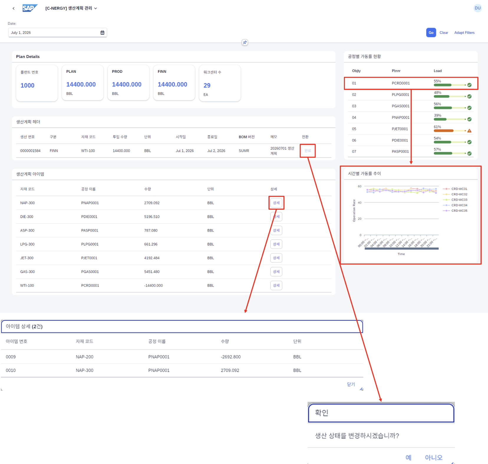

# [PP] 생산 관리

- **개요**: 일자 기준 생산 오더 시작/완료 상태 관리, 완료 시점 설비 처리량 기반 실제 생산량 계산.

- **비즈니스 로직**:
  1. 일자 기준 생산 오더 조회, 시작/완료 버튼으로 생산 관리
  2. 시작 시점: 계획값 설비 분배, 작업 일정 생성
  3. 완료 시점: 설비 처리량×시간 계산으로 실제 생산량 산출
  4. DB 작업별 에러 여부 반환, LUW 고려 최종 COMMIT/ROLLBACK(ALL OR NOTHING) 적용
  5. 미래 시점 계획 백엔드 제한, 커스텀 HTTP 에러 및 문장 반환

- **관련 테이블**: [`ZTB1PP0013`](../../04_design/table_specifications/02_PP_table_spec.md#index13)(생산계획·오더 헤더), [`ZTB1PP0014`](../../04_design/table_specifications/02_PP_table_spec.md#index14)(생산계획·오더 아이템), [`ZTB1PP0004`](../../04_design/table_specifications/02_PP_table_spec.md#index04)(Work Center 마스터), [`ZTB1PP0005`](../../04_design/table_specifications/02_PP_table_spec.md#index05)(WC 운영 스케줄), [`ZTB1PP0006`](../../04_design/table_specifications/02_PP_table_spec.md#index06)(WC 이벤트 헤더), [`ZTB1PP0007`](../../04_design/table_specifications/02_PP_table_spec.md#index07)(WC 이벤트 아이템)

- **기술 스택**: ABAP RAP(Behavior Definition Determination/Validation), LUW 트랜잭션 제어, Fiori Elements Object Page + Custom Action

- **연동 흐름**: 생산 완료 확정 → 자재 수불 자동 생성([`ZTB1MM0011`](../../04_design/table_specifications/01_MM_table_spec.md#index11), [`ZTB1MM0012`](../../04_design/table_specifications/01_MM_table_spec.md#index12), 이동유형 261) → CO 공정 실적 비용([`ZTB1CO0006`](../../04_design/table_specifications/05_CO_table_spec.md#index06)) 산출 트리거

