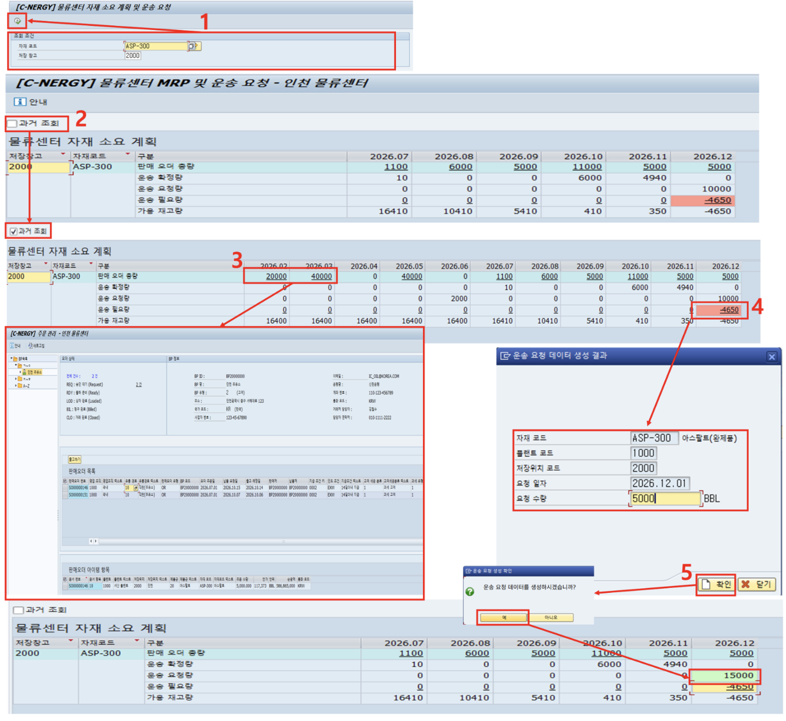

# [SD] 자재 운송 보충 계획

- **개요**: 물류센터별 자재 소요 계획 조회, 부족분 재고 보충 요청 문서 생성 및 판매오더·운송 요청 연계.

- **비즈니스 로직**:
  1. 자재/저장창고 조건 입력 후 실행
  2. 과거 조회 체크 시 전월 데이터 기준 물류센터 가용 재고량 조회
  3. 판매오더 총량 핫스팟 클릭 → 판매오더 관리 프로그램 이동
  4. 부족(빨간색) 핫스팟 클릭 → 재고 보충 요청 문서 생성 팝업 출력
  5. 확인 시 운송 요청량에 요청량 합산, 이후 승인 처리 프로그램으로 연계

- **관련 테이블**: [`ZTB1SD0012`](../../04_design/table_specifications/03_SD_table_spec.md#index12)(재고 보충 요청 테이블), [`ZTB1MM0003`](../../04_design/table_specifications/01_MM_table_spec.md#index03)(저장위치별 재고)

- **기술 스택**: Fiori Elements List Report(월별 소요계획 매트릭스), OData Navigation(핫스팟), Custom Popup Action

- **연동 흐름**: 재고 보충 요청 생성 → MM 구매오더/서비스오더 프로그램 신규 조달 트리거 연계

