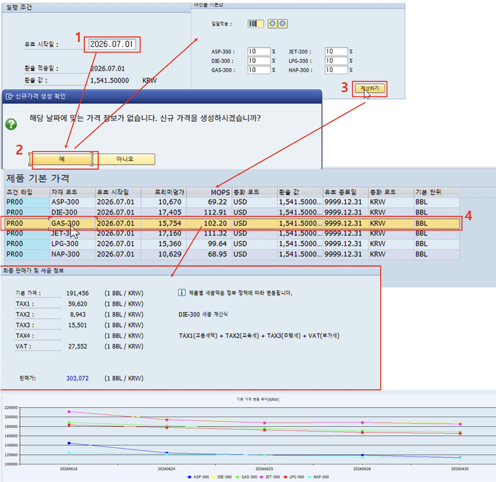

# [SD] 완제품 판매가 결정

- **개요**: MOPS(국제 유가지표) 기반 원가에 마진율 반영, 완제품 기본 판매가 산정 및 세금 항목 계산.

- **비즈니스 로직**:
  1. 유효 시작일 필드에 당일 날짜 입력
  2. 입력 날짜 가격 정보 부재 시 신규 가격 생성 확인 팝업
  3. 제품별 마진율 입력 후 계산하기 클릭 → MOPS 기반 프리미엄가 계산, 최근 5일 기본 가격 변동 추이 차트 표시
  4. 행 더블클릭 시 제품 세금 정보 및 1BBL당 판매가 표시(TAX1~4 + VAT)

- **관련 테이블**: [`ZTB1SD0004`](../../04_design/table_specifications/03_SD_table_spec.md#index04)(가격 조건 마스터), [`ZTB1FI0009`](../../04_design/table_specifications/04_FI_table_spec.md#index09)(MOPS 테이블), [`ZTB1FI0007`](../../04_design/table_specifications/04_FI_table_spec.md#index07)(환율)

- **기술 스택**: ABAP RAP(가격 조건 BO), CDS View(MOPS·환율 조인 산식), Fiori Elements + Chart Annotation

- **연동 흐름**: 확정 가격(PR00) → 판매오더 생성 프로그램 단가 소스([`ZTB1SD0005`](../../04_design/table_specifications/03_SD_table_spec.md#index05) 가격 로그) → 대금청구([`ZTB1SD0011`](../../04_design/table_specifications/03_SD_table_spec.md#index11))까지 연쇄 반영

