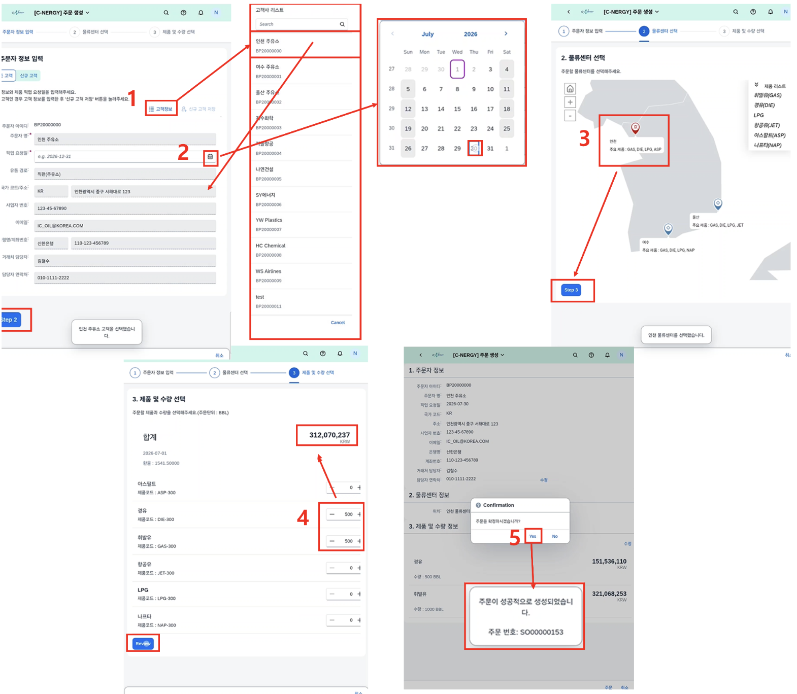

# [SD] 판매오더 생성

- **개요**: 고객 정보-픽업 일정-물류센터-제품/수량 단계별 입력, 판매오더 생성.

- **비즈니스 로직**:
  1. 고객 정보 버튼으로 주문자 선택 → 거래처 정보 자동 채움
  2. 픽업 날짜 입력 후 다음 단계 이동
  3. 픽업 물류센터 선택(지도 UI)
  4. 제품·수량 입력, 수량 변경 시 상단 판매금액 실시간 갱신
  5. 검토 페이지 확인 후 주문 버튼 → 판매오더 생성(주문번호 발급)

- **관련 테이블**: [`ZTB1SD0006`](../../04_design/table_specifications/03_SD_table_spec.md#index06)(판매오더 헤더), [`ZTB1SD0007`](../../04_design/table_specifications/03_SD_table_spec.md#index07)(판매오더 아이템), [`ZTB1SD0005`](../../04_design/table_specifications/03_SD_table_spec.md#index05)(판매오더 가격 로그)

- **기술 스택**: Fiori Elements Multi-Step Wizard(Guided Flow), Google Maps 임베드(물류센터 선택), RAP Draft(단계별 임시저장)

- **연동 흐름**: 오더 생성 → 출고 문서([`ZTB1SD0008`](../../04_design/table_specifications/03_SD_table_spec.md#index08), [`ZTB1SD0009`](../../04_design/table_specifications/03_SD_table_spec.md#index09)) → 대금청구([`ZTB1SD0010`](../../04_design/table_specifications/03_SD_table_spec.md#index10), [`ZTB1SD0011`](../../04_design/table_specifications/03_SD_table_spec.md#index11)) → FI 매출전표 자동 인터페이스

