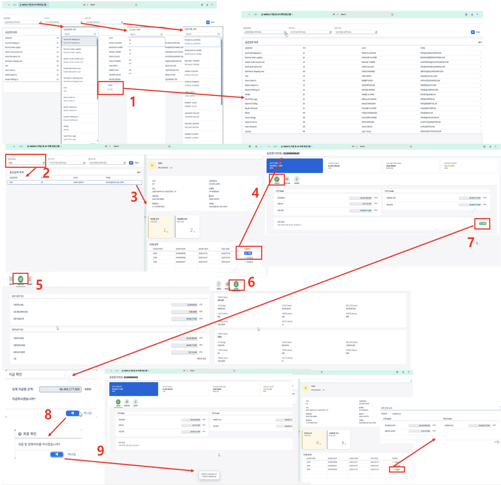

# [FI] AP 반제 처리

- **개요**: 공급업체별 미결 채무 조회, 지급 처리 후 반제 전표 생성.

- **비즈니스 로직**:
  1. 공급업체 조회
  2. 행 클릭 시 공급업체 상세정보 및 거래내역 조회
  3. 지급버튼 클릭 → 지급 상세 페이지 이동
  4. 각 탭에서 지급액, 외환차손익 발생액, 송장 아이템 내역 확인
  5. 지급 버튼 클릭 → 반제 전표 생성
  6. 지급완료 클릭 → 반제 전표 번호 및 전표 내역 조회

- **관련 테이블**: `ZTBF10002`(전표 아이템 - LIFNR/AUGBL), `ZTBF10010`(반제/미반제 관리)

- **기술 스택**: ABAP RAP(반제 처리 BO, 외화환산 로직 포함), Fiori Elements Object Page

- **연동 흐름**: 반제 확정 → `ZTBF10010.STATUS`를 `C`(Clear)로 갱신, 반제 전표(AUGBL) 원 전표 매핑 → 전표 대시보드에서 조회

