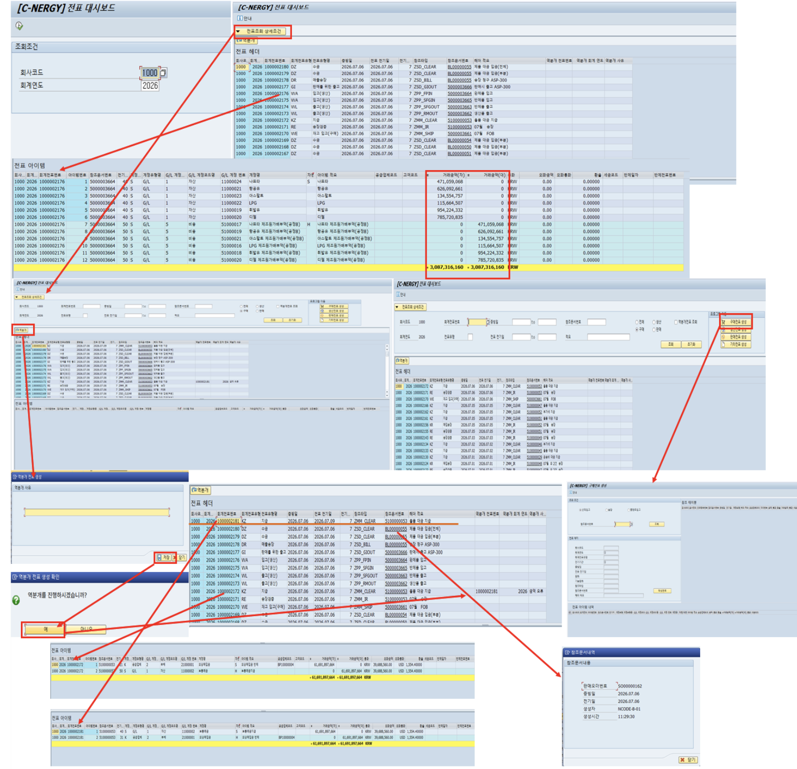

# [FI] 전표 대시보드

- **개요**: 회사코드/회계연도 기준 전표 통합 조회, 헤더-아이템 드릴다운·역분개·참조문서 확인 가능한 FI 통합 뷰.

- **비즈니스 로직**:
  1. 조회조건(회사코드/회계연도) 입력 후 실행
  2. 전표 헤더 더블클릭 시 전표 아이템 출력
  3. 전표조회 상세조건 클릭 후 조건 추가 입력
  4. 각 프로그램(생산전표생성, AP/AR반제 등)으로 이동
  5. 전표 헤더 한 행 선택 후 역분개
  6. 전표 헤더 핫스팟 클릭 시 참조문서내역 확인

- **관련 테이블**: [`ZTB1FI0001`](../../04_design/table_specifications/04_FI_table_spec.md#index01)(전표 헤더), [`ZTB1FI0002`](../../04_design/table_specifications/04_FI_table_spec.md#index02)(전표 아이템)

- **기술 스택**: Fiori Elements List Report + Object Page(Header-Item Drilldown), OData Deep Navigation, Custom Action(역분개)

- **연동 흐름**: 모듈별 전표 원천(MM 자재문서, SD 청구문서, PP 생산전표 등)을 ZAWTYP/ZAWKEY로 역추적하는 FI 통합 허브

