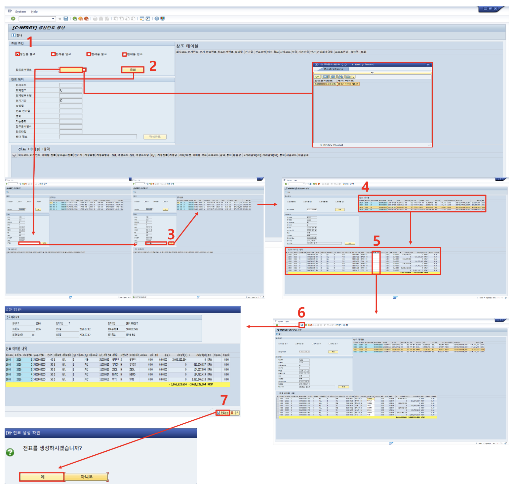

# [FI] 생산 전표 수동 생성

- **개요**: 생산 관련 참조문서(생산오더 등) 기반, 전표 헤더/아이템 수동 생성.

- **비즈니스 로직**:
  1. 라디오 버튼으로 생성할 전표 시점 선택
  2. 서치헬프로 참조문서번호 선택 후 조회
  3. 전표 헤더 적요 입력 후 '작성완료'로 전표 헤더 작성
  4. 참조 테이블 행 더블클릭 → 전표 아이템 생성
  5. 아이템 적요 입력 → 전표 아이템 생성
  6. '저장' 아이콘 클릭 → 최종 검토 팝업 확인 → '전표생성'

- **관련 테이블**: [`ZTB1FI0001`](../../04_design/table_specifications/04_FI_table_spec.md#index01)(전표 헤더), [`ZTB1FI0002`](../../04_design/table_specifications/04_FI_table_spec.md#index02)(전표 아이템), [`ZTB1PP0013`](../../04_design/table_specifications/02_PP_table_spec.md#index13)(참조 대상 생산오더), [`ZTB1PP0014`](../../04_design/table_specifications/02_PP_table_spec.md#index14)(참조 대상 생산오더 아이템)

- **기술 스택**: ABAP RAP(전표 생성 BO), Search Help(F4 참조문서 선택), Fiori Elements Custom Page

- **연동 흐름**: 생산 오더 확정만으로 자동 인터페이스되지 않는 예외 케이스(수동 조정) 보완 처리

