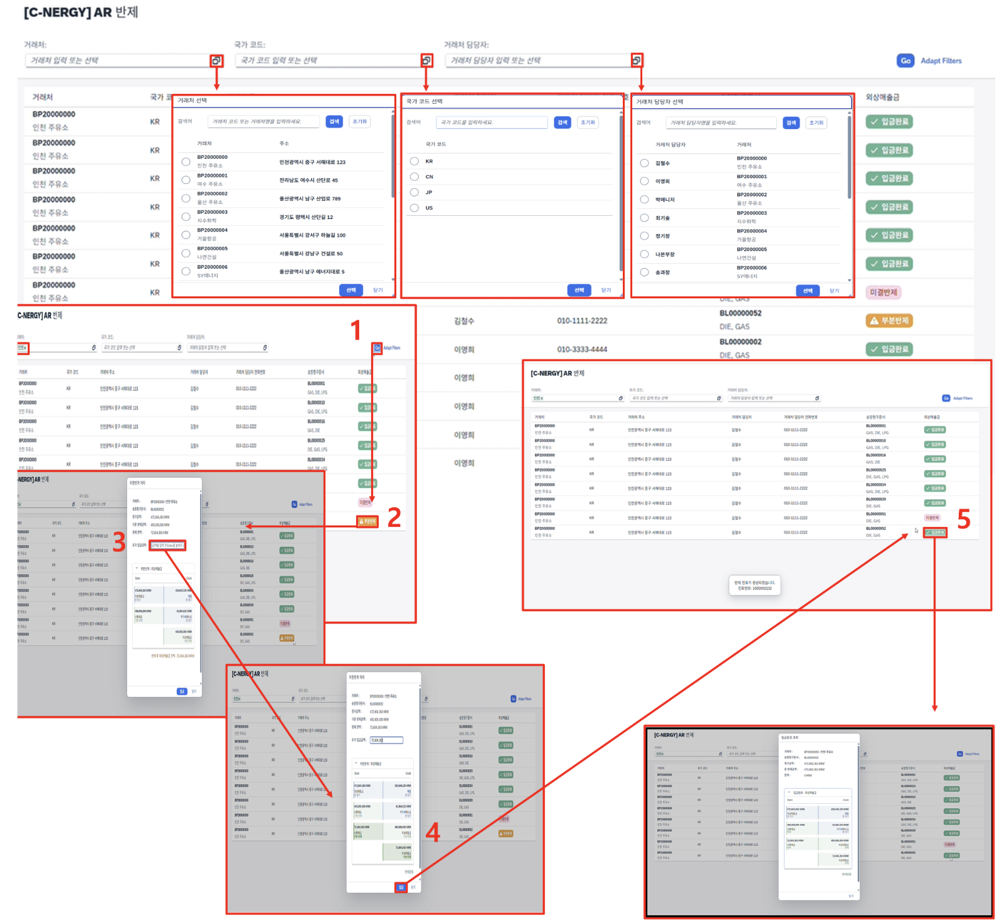

# [FI] AR 반제 처리

- **개요**: 거래처(국가/담당자 기준) 검색, 송장청구문서 조회 후 입금 반제(미결/부분) 처리.

- **비즈니스 로직**:
  1. 거래처, 판매처 담당자 검색으로 송장청구문서번호 확인
  2. '미결반제' 또는 '부분반제' 버튼으로 반제 시작(상태 라벨 전환)
  3. 입금 금액 입력 후 Enter
  4. 생성될 반제전표 및 잔액 확인 후 '입금' 버튼으로 반제 처리
  5. 부분반제 완료 시 '입금완료' 상태 전환, 조회용 팝업 출력

- **관련 테이블**: [`ZTB1FI0010`](../../04_design/table_specifications/04_FI_table_spec.md#index10)(반제/미반제 관리), [`ZTB1SD0010`](../../04_design/table_specifications/03_SD_table_spec.md#index10)(대금 청구 헤더), [`ZTB1SD0011`](../../04_design/table_specifications/03_SD_table_spec.md#index11)(대금 청구 아이템)

- **기술 스택**: ABAP RAP(부분반제 로직 - 잔액 재계산), Fiori Elements Custom Page(다단계 검색 + 반제 실행)

- **연동 흐름**: 반제 완료 → [`ZTB1FI0010`](../../04_design/table_specifications/04_FI_table_spec.md#index10).STATUS = C 갱신 → 전표 대시보드에서 반제 전표 조회

