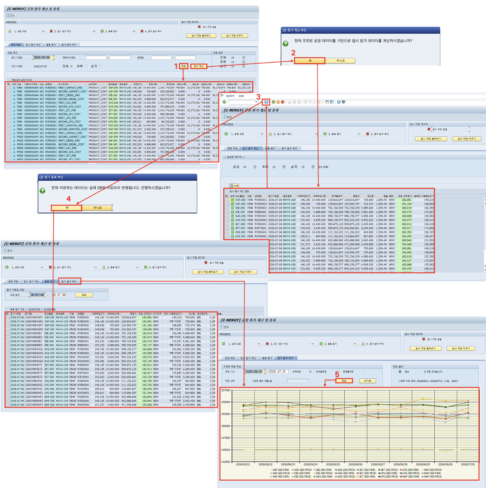

# [CO] 제품별 원가 계산 및 등록

- **개요**: 공정비 데이터 날짜 기준 계산, 제품별 원가 산정 및 등록(전표 반영).

- **비즈니스 로직**:
  1. 이전 프로그램(공정 실적 비용) 계산 데이터 날짜별 조회
  2. '계산하기' 클릭 → 제품별 수율로 공정비 배분, 데이터 임시 생성
  3. 수치 확인 후 저장 클릭 → 재고 반영, 전표 등록, 제품별 원가 변동 확인
  4. 등록 원가 탭에서 날짜별 등록 공정원가 조회
  5. 원가 변동 추이 탭에서 제품별 원가 변동 추이 선그래프 조회

- **관련 테이블**: [`ZTB1CO0005`](../../04_design/table_specifications/05_CO_table_spec.md#index05)(공정 계획 비용), [`ZTB1CO0006`](../../04_design/table_specifications/05_CO_table_spec.md#index06)(공정 실적 비용), [`ZTB1CO0007`](../../04_design/table_specifications/05_CO_table_spec.md#index07)(반제품/완제품 원가), [`ZTB1CO0008`](../../04_design/table_specifications/05_CO_table_spec.md#index08)(제품원가 결과 상세)

- **기술 스택**: ABAP RAP(원가 배분 BO, 수율 기반 배부 로직), CDS View(원가 변동 추이 집계)

- **연동 흐름**: 원가 확정(CFRMD=Y) → FI 재고평가([`ZTB1MM0001`](../../04_design/table_specifications/01_MM_table_spec.md#index01).VERPR) 갱신 트리거 → 전표 대시보드에 원가 반영 전표 노출

