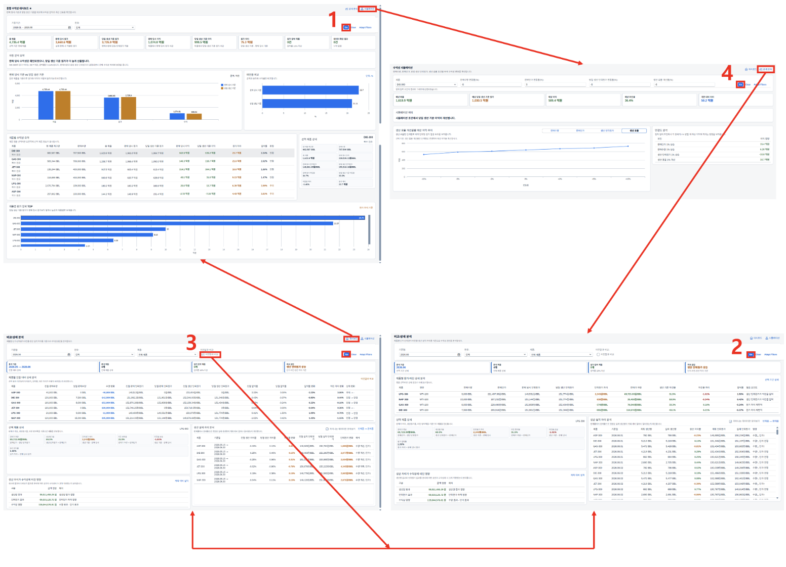

# [CO] 수익성 분석

- **개요**: 이동평균단가·공정원가·판매단가 종합, 매출 상세 분석·계획-실적 비교·시뮬레이션 제공(3-Tab).

- **비즈니스 로직**:
  1. TAB1: 기간·원유 종류 기반 이동평균단가·공정 당일원가로 매출 상세 분석·조회
  2. TAB2: 기준 월/원유/제품 기반 계획-실적 생산량 비교, 매출적 이익/손실 분석. '이전달과 비교' 체크 시 전달 대비 조회
  3. TAB3: 판매수량·판매단가·당일 생산 단위원가·생산 효율 변수로 매출적 이익 시뮬레이션

- **관련 테이블**: [`ZTB1CO0007`](../../04_design/table_specifications/05_CO_table_spec.md#index07)(반제품/완제품 원가), [`ZTB1CO0008`](../../04_design/table_specifications/05_CO_table_spec.md#index08)(원가 결과 상세), [`ZTB1CO0009`](../../04_design/table_specifications/05_CO_table_spec.md#index09)(공정 원가 최적화 시뮬레이션)

- **기술 스택**: Fiori Elements Analytical List Page(차트+테이블), CDS View(원가·매출 조인), What-if 시뮬레이션 로직(TAB3)

- **연동 흐름**: 제품별 원가 계산 프로그램 확정 원가([`ZTB1CO0007`](../../04_design/table_specifications/05_CO_table_spec.md#index07)) + SD 판매 실적을 소스로 하는 CO 최종 리포팅 단계

